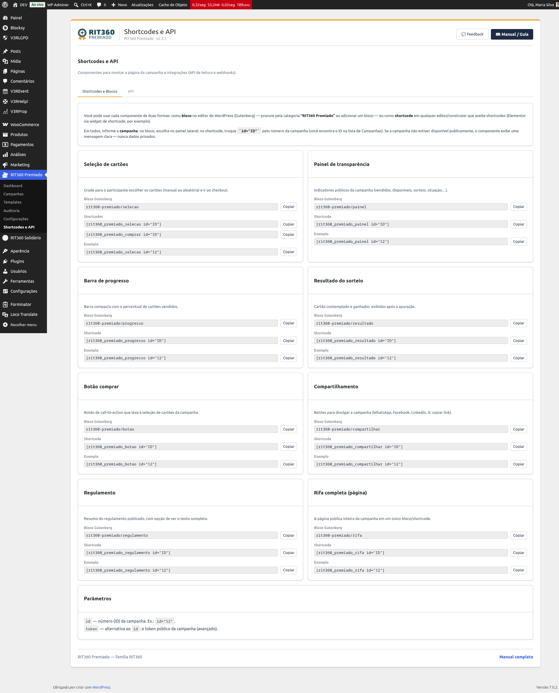
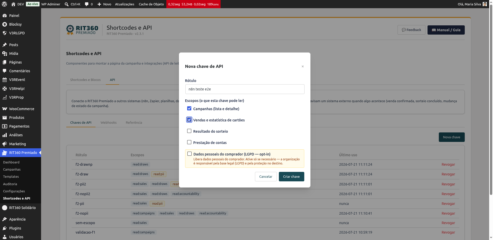
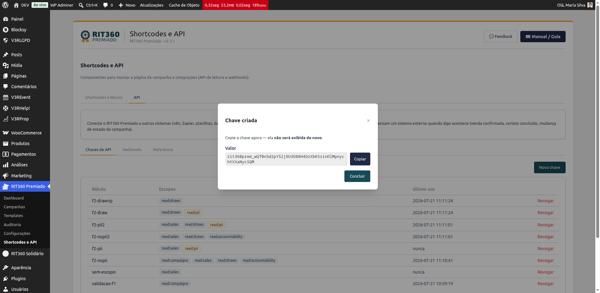
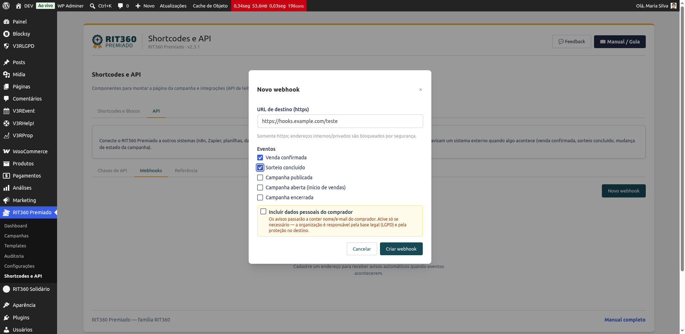
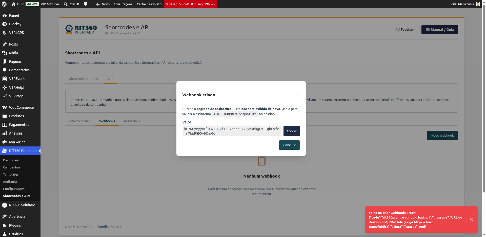
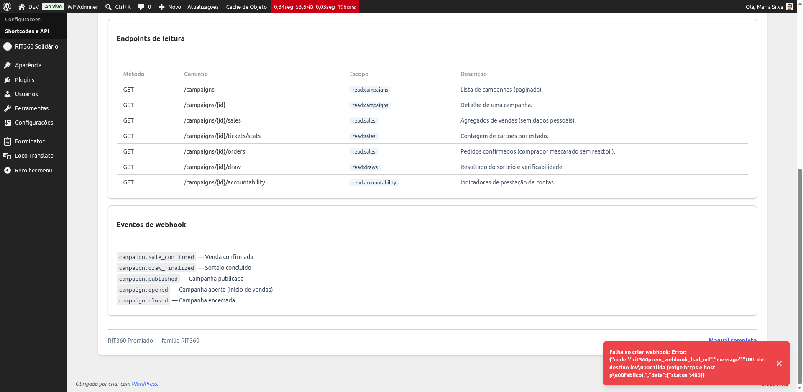

# Integrar com outros sistemas (API e webhooks)

A partir da versão **2.4.0**, você pode conectar o RIT360 Premiado a outros sistemas — como **n8n**, **Zapier**, planilhas ou painéis — de duas formas:

- **API de leitura:** o outro sistema **puxa** dados das suas campanhas (vendas, cartões, resultado do sorteio, prestação de contas) usando uma **chave**.
- **Webhooks:** o plugin **avisa** um endereço externo automaticamente quando algo acontece (uma venda confirmada, o sorteio concluído, a campanha aberta ou encerrada).

Tudo fica na tela **Shortcodes e API** (o antigo "Blocos e Shortcodes", agora com uma aba a mais).

## Onde fica

No menu do RIT360 Premiado, abra **Shortcodes e API** e clique na aba **API**. Dentro dela há três sub-abas: **Chaves de API**, **Webhooks** e **Referência**.

## Criar uma chave de API

A chave é como uma senha que o sistema externo usa para ler seus dados.

1. Na aba **API › Chaves de API**, clique em **Nova chave**.
2. Dê um **rótulo** para lembrar onde vai usá-la (ex.: "n8n produção").
3. Marque os **escopos** — o que essa chave pode ler (Campanhas, Vendas, Resultado do sorteio, Prestação de contas).

   

4. Clique em **Criar chave**. A chave aparece **uma única vez** — copie e guarde num lugar seguro. Se perder, é só criar outra.

   

No sistema externo, use a chave no cabeçalho `Authorization: Bearer <sua-chave>`.

> **Precisa revogar?** Clique em **Revogar** na chave. Ela para de funcionar na hora e some da lista.

## O escopo "Dados pessoais" (LGPD)

Por padrão, a API entrega números e dados **mascarados** (ex.: `j***@dominio.com`) — nunca o dado pessoal completo do comprador.

Se você marcar o escopo **"Dados pessoais do comprador (LGPD)"**, a chave passa a expor nome e e-mail completos. Ative **só se realmente precisar** (ex.: sincronizar um CRM): a organização é responsável por ter **base legal** para esse envio e por proteger os dados no destino. A ativação fica registrada na trilha de auditoria.

## Cadastrar um webhook

Um webhook avisa um endereço seu toda vez que um evento acontece.

1. Na aba **API › Webhooks**, clique em **Novo webhook**.
2. Informe a **URL de destino** (precisa ser `https`; endereços internos são bloqueados por segurança).
3. Marque os **eventos** que quer receber: venda confirmada, sorteio concluído, campanha publicada/aberta/encerrada.

   

4. Clique em **Criar webhook**. O sistema mostra **uma única vez** um **segredo** — guarde-o. Ele serve para o seu sistema conferir que o aviso veio mesmo do plugin (assinatura `X-RIT360PREM-Signature`).

   

Como nas chaves, marque **"Incluir dados pessoais"** só se necessário — sem isso, os avisos vão com os dados mascarados.

## Acompanhar as entregas

Em cada webhook, clique em **Entregas** para ver o histórico: o que foi entregue, o que está tentando de novo e o que falhou. Se um destino ficou fora do ar e a entrega falhou, você pode clicar em **Reenviar**. O plugin já **tenta de novo sozinho**, com intervalos crescentes, por algumas vezes, antes de desistir.

## Ver os endereços e eventos disponíveis

A sub-aba **Referência** mostra o **endereço base** da sua API, a lista de **endpoints** (o que dá para ler e qual escopo cada um exige) e os **eventos** de webhook.

## Dúvidas comuns

- **Preciso saber programar?** Para usar em ferramentas visuais como n8n/Zapier, basta a chave (ou a URL do webhook) e apontar os campos. A parte técnica fica no sistema externo.
- **A API pode alterar minhas campanhas?** Não. Nesta versão a API é **somente leitura**. Webhooks apenas avisam; não recebem comandos.
- **Perdi a chave/segredo.** Não dá para vê-los de novo — crie uma nova chave/webhook e atualize no sistema externo.
